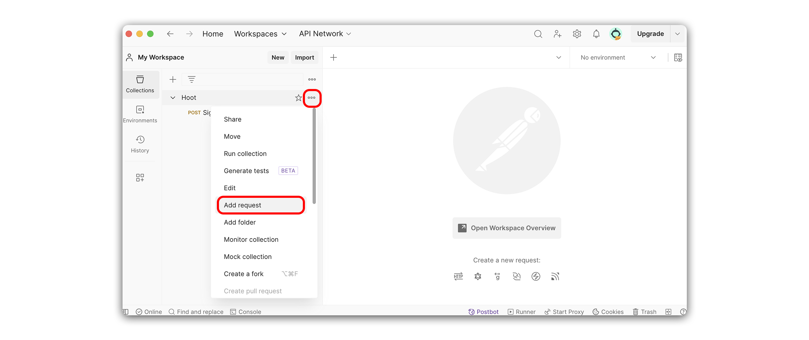
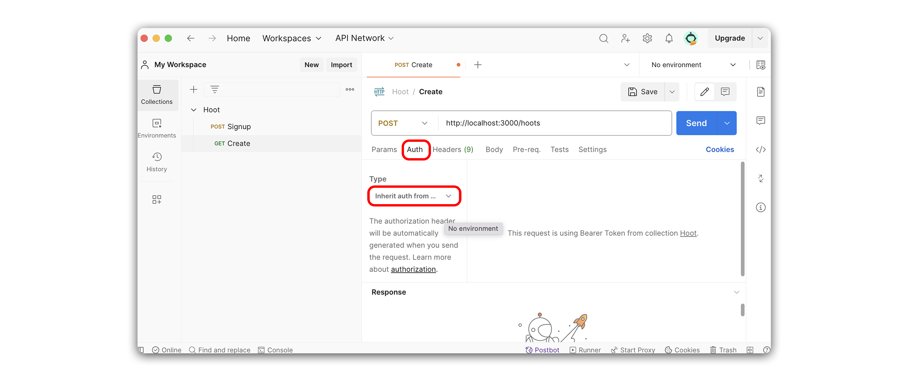
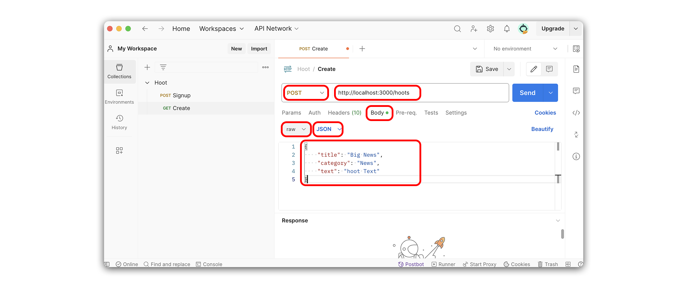
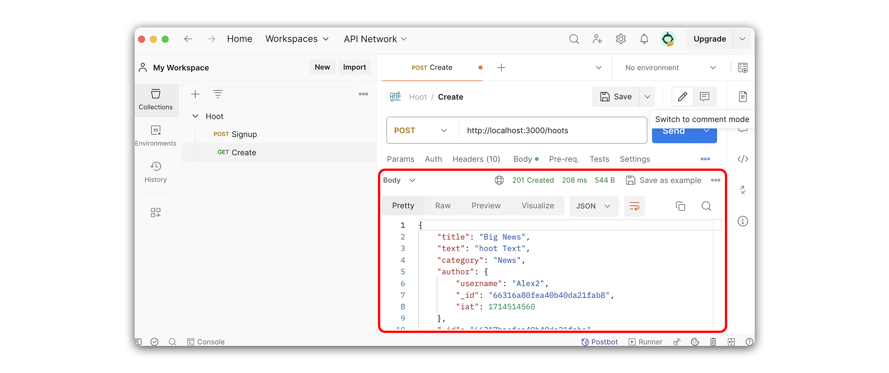

# 

**Learning objective:** By the end of this lesson, students will be able to build a request that adds hoots to the database and sends a JSON response to the client.

## Overview

In this section, we will make a route to create a new hoot. This route will be a `POST` request to `/hoots`, and will return a JSON response with the new hoot document. The purpose of this route is to handle data that is sent along with a **form submission**.

We will be following these specs when building the route:

- CRUD Action: CREATE
- Method: `POST`
- Path: `/hoots`
- Response: JSON
- Success Status Code: `201` Created
- Success Response Body: A new hoot object
- Error Status Code: `500` Internal Server Error
- Error Response Body: A JSON object with an error key and a message describing the error

## Create a `hootsRouter`

Before we can start writing the route and controller function, we'll need to create a `hootsRouter` and mount it to `server.js`.

Run the following commands in your terminal:

```bash
touch controllers/hoots.js
```

Add the following boilerplate to `controllers/hoots.js`.

```jsx
// controllers/hoots.js
const express = require('express');
const verifyToken = require('../middleware/verify-token.js');
const Hoot = require('../models/hoot.js');
const router = express.Router();

// ========== Public Routes ===========

// ========= Protected Routes =========
router.use(verifyToken);


module.exports = router;
```

In `server.js`, let's import the `hootsRouter` and add it to our `'/hoots'` route.

Add the following to `server.js`:

```jsx
// server.js
const hootsRouter = require('./controllers/hoots.js');
```

And mount the router:

```jsx
// server.js
app.use('/hoots', hootsRouter);
```

## Define the route

Next we'll define a route that listens for `POST` requests on `'/hoots'`:

```
POST /hoots
```

Add the following to `controllers/hoots.js`:

```jsx
// controllers/hoots.js
// ========= Protected Routes ========= 
router.use(verifyToken);

router.post('/', async (req, res) => { });
```

> 🏆 Any route that requires auth should go below `router.use(verifyToken)`. These are our **Protected Routes**. A user needs to be logged in to create a hoot, so we should define our new route inside the **Protected Routes** section of `controllers/hoots.js`.

> 💡 In `server.js`, we defined a base path of `/hoots` for our `hootsRouter`. Therefore, we will provide the `router` above with a path of `'/'`, as this will be appended to the end of what is defined in `server.js`.

## Code the controller function

Let's breakdown what we'll accomplish inside our controller function.

First, before creating a `hoot`, we'll append `req.user._id` to `req.body.author`. This updates the form data that will be used to create the resource, and ensures that the logged in user is marked as the `author` of a `hoot`. 

Next, we'll call `create()` on our `Hoot` model, and pass in `req.body`. The `create()` method will return a new `hoot` document. The `author` property of this document **will only contain an ObjectId**, as the data has not yet been populated. In lieu of the `populate()` method, we'll append a complete `user` object to the `hoot` document, as `user` is already accessible on our request object (`req`). 

> 💡 Without this step, newly submitted hoots on the client-side would not be able to immediately render information about the author.

Once the new `hoot` is created, we'll send a JSON response with the new `hoot` object.

Add the following to `controllers/hoots.js`:

```jsx
// controllers/hoots.js
router.post('/', async (req, res) => {
  try {
    req.body.author = req.user._id;
    const hoot = await Hoot.create(req.body);
    hoot._doc.author = req.user;
    res.status(201).json(hoot);
  } catch (error) {
    console.log(error);
    res.status(500).json(error);
  }
});
```

> 💡 When we call upon `create()`, the newly created document is not just a plain JavaScript object, but an instance of a **Mongoose document**. Before being converted to JSON, this document adds another layer to the structure of a `hoot`, including a `_doc` property containing the document that was retrieved from MongoDB. Normally, we don't need to concern ourselves with this detail, but because we are modifying the `author` property before issuing a response, we'll need to go through the `_doc` property of `hoot`, to access the actual document.

## Test the route in Postman

Now that we have finished the route let's test it with Postman. We'll do this by sending a `POST` request to `http://localhost:3000/hoots`. 

Recall that our `hootSchema` has the following specifications:

```js
// models/hoot.js
const hootSchema = new mongoose.Schema(
  {
    title: {
      type: String,
      required: true,
    },
    text: {
      type: String,
      required: true,
    },
    category: {
      type: String,
      required: true,
      enum: ['News', 'Sports', 'Games', 'Movies', 'Music', 'Television'],
    },
    author: { type: mongoose.Schema.Types.ObjectId, ref: 'User' },
    comments: [commentSchema]
  },
  { timestamps: true }
);
```

In **Postman**, make a new `POST` request called **Create**. 



> 🚨 Be sure to add this request to your **Hoot** collection.

The correct URL is provided below.

```
http://localhost:3000/hoots
```

Since this request requires authentication, we'll need to give **Postman** access to our token from the previous step. 

Select the **Authorization** tab, and make sure the **Type** is set to **Inherit auth from parent**.



Within the **Body** tab, select **raw**, and change the **Text** dropdown to **JSON**. Next, add the following to the body in **Postman.** 

```json
{
    "title": "Big News",
    "category": "News",
    "text": "hoot Text"
}
```

Your request in **Postman** should look something like this. Note the changed values highlighted below, and don’t forget to save:



If your request was successful, you should see something like the response below:

