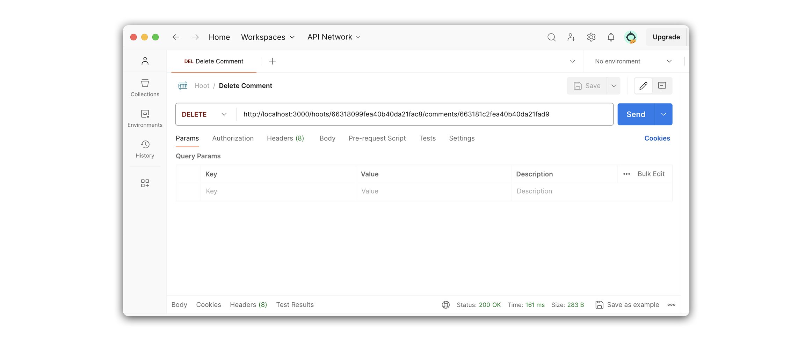
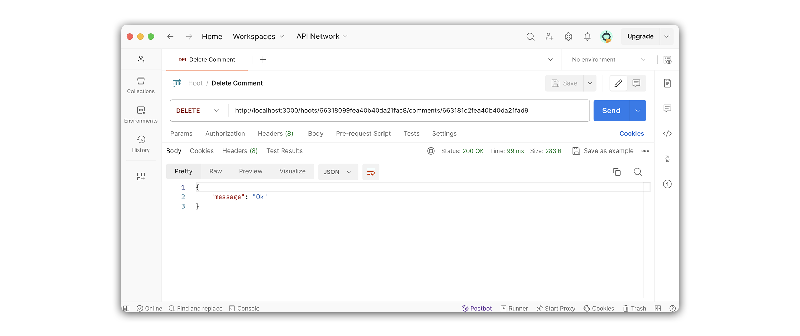

# 

**Learning objective:** By the end of this lesson, students will be able build a route that deletes embedded subdocuments inside a single hoot.

## Overview

In this section, we will create a delete route to find and delete a single comment within a hoot.

We will be following these specs when building the route:

- CRUD Action: DELETE
- Method: `DELETE`
- Path: `/hoots/:hootId/comments/:commentId`
- Response: JSON
- Success Status Code: `200` Ok
- Success Response Body: A JSON status message.
- Error Status Code: `500` Internal Server Error
- Error Response Body: A JSON object with an error key and a message describing the error

## Define the route

Our route will listen for `DELETE` requests on `/hoots/:hootId/comments/:commentId`:

```
DELETE /hoots/:hootId/comments/:commentId
```

Add the following to `controllers/hoots.js`:

```js
// controllers/hoots.js
router.delete('/:hootId/comments/:commentId', async (req, res) => { });
```

> 🧠 This route might be seem intimidating at first. It requires both a `hootId` a `commentId`, so that we can locate both the parent, and then the child document within it.

> 🚨 A user needs to be logged in to update a comment, so we should define our new route inside the **Protected Routes** section of `controllers/hoots.js`.

## Code the controller function

Let's breakdown what we'll accomplish inside our controller function.

First we call upon the `Hoot` model's `findById()` method. The retrieved `hoot` is the parent document that holds an array of `comments`. We'll need to remove a specific comment from this array.

To do so, we'll make use of the [MongooseArray.prototype.remove()](https://mongoosejs.com/docs/5.x/docs/api/array.html#mongoosearray_MongooseArray-remove) method. This method is called on the array property of a document, and **removes** an embedded subdocument based on the provided query object (`{ _id: req.params.commentId }`).

After removing the subdocument, we save the parent `hoot` document, and issue a JSON response with a `message` of `Ok`.

Add the following to `controllers/hoots.js`:

```js
// controllers/hoots.js
router.delete('/:hootId/comments/:commentId', async (req, res) => {
  try {
    const hoot = await Hoot.findById(req.params.hootId);
    hoot.comments.remove({ _id: req.params.commentId });
    await hoot.save();
    res.status(200).json({ message: "Ok"});
  } catch (err) {
    res.status(500).json(err);
  }
});
```

## Test the route in Postman

Create a new request in **Postman**. Let's name this request **Delete Comment** and set its request type to `DELETE`. Your **Postman** URL should look something like this.

```
http://localhost:/hoots/63390dddff7c27bc4b86a1aa/comments/633915e08845c5a891cd4bf2
```

Your **Postman** request should look something like this:



The response should be an object containing a `message: "Ok"` property:

