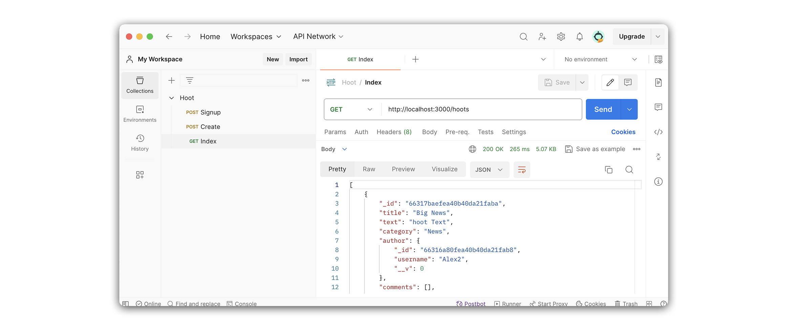

# 

**Learning objective:** By the end of this lesson, students will be able to create an index route to retrieve all hoots from the database and send this data as a JSON response to the client.

## Overview

In this section, we will create a new route to find all hoots. This route will be a `GET` request to `/hoots`, and will return a JSON response with all the `hoots` in the database.

We will be following these specs when building the route:

- CRUD Action: READ
- Method: `GET`
- Path: `/hoots`
- Response: JSON
- Success Status Code: `200` Ok
- Success Response Body: An array of all the hoots in the database named hoots. The array will be empty if there are no hoots in the database.
- Error Status Code: `500` Internal Server Error
- Error Response Body: A JSON object with an error key and a message describing the error.

## Define the route

Our route will listen for `GET` requests on `'/hoots'`:

```
GET /hoots
```

Inside `controllers/hoots.js`, add the following:

```jsx
// controllers/hoots.js
router.get('/', async (req, res) => { });
```

> 🚨 A user needs to be logged in to view a list of hoots, so we should define our new route inside the **Protected Routes** section of `controllers/hoots.js`.

> 💡 Restricting access to the `index` and `show` functionality will reduce the amount of conditional rendering we need to implement in our React app. 

## Code the controller function

Let's breakdown what we'll accomplish inside our controller function.

We'll call upon the `find({})` method of our `Hoot` model, retrieving all `hoots` from the database. When we call upon `find({})`, we'll chain two additional methods to the end. 

- The first is the `populate()` method. We'll use this to populate the `author` property of each hoot with a `user` object.

- The second is the `sort()` method. We'll use this to sort `hoots` in descending order, meaning the most recent entries will be at the at the top.

Once the new `hoots` are retrieved, we'll send a JSON response containing the `hoots` array.

Add the following to `controllers/hoots.js`:

```jsx
// controllers/hoots.js
router.get('/', async (req, res) => {
  try {
    const hoots = await Hoot.find({})
      .populate('author')
      .sort({ createdAt: 'desc' });
    res.status(200).json(hoots);
  } catch (error) {
    res.status(500).json(error);
  }
});
```

## Test the route in Postman

Now that we have finished the route let's test it with Postman. We'll do this by sending a `GET` request to `http://localhost:3000/hoots`. 

Within Postman, create a new `GET` request. We'll name this request **Index**. 

Your Postman URL should look like this:

```
http://localhost:3000/hoots
```

If your request was successful, the response will include an array of `hoot` objects, with a populated `author` property inside each `hoot` object:


