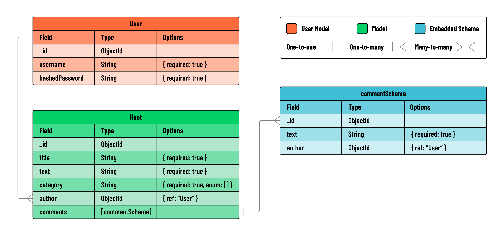

# 

**Learning objective:** By the end of this lesson, students will be able to tktk

## Overview

In this module, we'll build an Express API that serves as the backend for a full-stack blogging application called **Hoot**.

Within our Express API, we'll implement full CRUD functionality on a blog post resource (`hoots`). Additionally, we will implement `create` functionality on an embedded resource called `comments`. 

Our Express API will make use of the [Express API JWT Auth Template](https://git.generalassemb.ly/modular-curriculum-all-courses/express-api-jwt-auth-template.git). This template provides our Express application with JWT Authentication. This style of authentication in HTTP uses tokens, or unique identifier strings, to tell who a user is when they're making an authenticated request. 

Thanks to this template, our Express application will be able to **sign up** and **sign in** users. The template also includes a `verifyToken` middleware function. The `verifyToken` middleware ensures that any route following it in the middleware pipeline will require authentication before proceeding.

To demonstrate JWT Authentication, our Express application will use `verifyToken` to *protect* all routes related to the `hoot` resource. This means users will be required to sign in before getting access to any `hoot` data.

## User Stories

Our Express API should include functionality for the following user stories:

- As a guest, I should be able to create an account.
- As a guest with an account, I should be able to log in to my account.
- AAU, I should be able to create a hoot post.
- AAU, I should be able to read a list of all hoots.
- AAU, I should be able to view information about a single hoot post along with its associated comments.
- AAU, I should be able to add a comment to a specific hoot.
- As the author of a hoot, I should be able to update that hoot. 
- As the author of a hoot, I should be able to delete that hoot.

User stories related to signing up and signing in have been included for us in the **Express API JWT Auth Template**, but we will be implementing the remaining features from scratch.

## Entity-Relationship Diagram

Take a look at the ERD below to get a sense of the data we'll be working with:

## Express & Postman

Below you can see a chart outlining the routes that will go into this application:

| HTTP Method | Controller | Response | URI | Use Case |
| --- | --- | --- | --- | --- |
| POST | create | 200 | /hoots | Create a hoot |
| GET | index | 200 | /hoots | List hoots |
| GET | show | 200 | /hoots/:hootId | Get a single hoot |
| PUT | update | 200 | /hoots/:hootId | Update a hoot |
| DELETE | deleteHoot | 200 | /hoots/:hootId | Delete a hoot |
| POST | createComment | 200 | /hoots/:hootId/comments | Create a comment |

> 🚨 In Postman, remember to double-quote all JSON keys in the data payload (body).