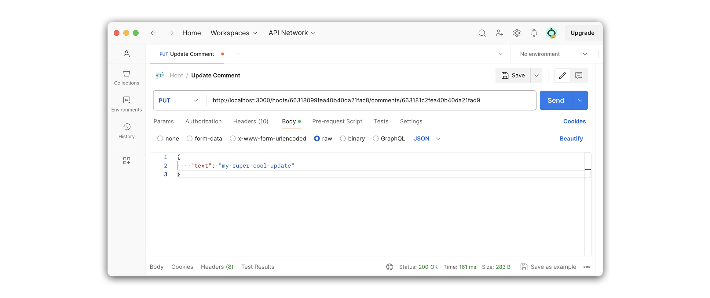
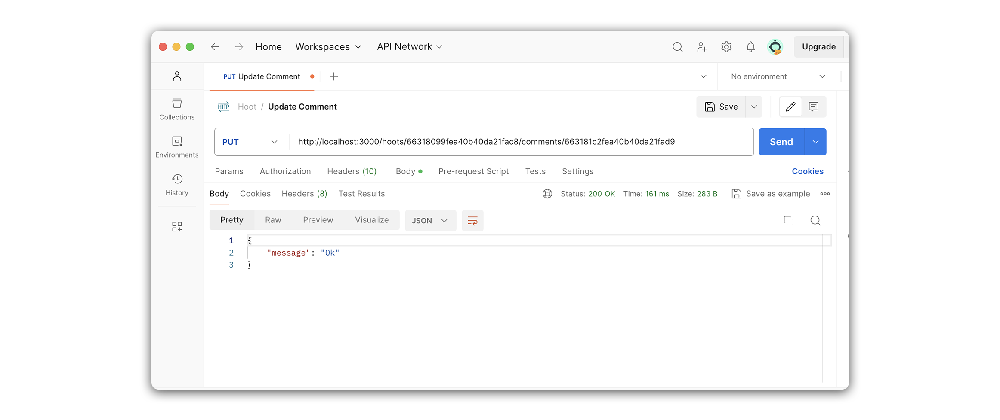

# 

**Learning objective:** By the end of this lesson, students will be able build a route that updates embedded subdocuments inside a single hoot.

## Overview

In this section, we will create an update route to find and update a single comment within a hoot.

We will be following these specs when building the route:

- CRUD Action: UPDATE
- Method: `PUT`
- Path: `/hoots/:hootId/comments/:commentId`
- Response: JSON
- Success Status Code: `200` Ok
- Success Response Body: A JSON status message.
- Error Status Code: `500` Internal Server Error
- Error Response Body: A JSON object with an error key and a message describing the error

## Define the route

Our route will listen for `PUT` requests on `/hoots/:hootId/comments/:commentId`:

```
PUT /hoots/:hootId/comments/:commentId
```

Add the following to `controllers/hoots.js`:

```js
// controllers/hoots.js

router.put("/:hootId/comments/:commentId", verifyToken, async (req, res) => {
  // add route
});
```

> 🧠 This route might be seem intimidating at first. It requires both a `hootId` and a `commentId`, so that we can locate both the parent, and the child document within it.

> ❗ A user needs to be logged in to update a comment, so be sure to include the `verifyToken` middleware.

### Code the controller function

Let's breakdown what we'll accomplish inside our controller function.

1. First we call upon the `Hoot` model's `findById()` method. The retrieved `hoot` is the parent document that holds an array of `comments`. We'll need to find the specific comment we wish to update within this array. To do so, we can use the [MongooseDocumentArray.prototype.id()](https://mongoosejs.com/docs/api.html#mongoosedocumentarray_MongooseDocumentArray-id) method. This method is called on the array of a document, and returns an embedded subdocument based on the provided ObjectId (`req.params.commentId`).

2. With the retrieved `comment`, we update its `text` property with `req.body.text`, before saving the parent document (`hoot`), and issuing a JSON response with a `message` of `Ok`.

Add the following to `controllers/hoots.js`:

```js
// controllers/hoots.js

router.put("/:hootId/comments/:commentId", verifyToken, async (req, res) => {
  try {
    const hoot = await Hoot.findById(req.params.hootId);
    const comment = hoot.comments.id(req.params.commentId);
    comment.text = req.body.text;
    await hoot.save();
    res.status(200).json({ message: "Ok" });
  } catch (err) {
    res.status(500).json(err);
  }
});

router.put("/:hootId/comments/:commentId", verifyToken, async (req, res) => {
  try {
    const hoot = await Hoot.findById(req.params.hootId);
    const comment = hoot.comments.id(req.params.commentId);

    // ensures the current user is the author of the comment
    if (comment.author.toString() !== req.user._id) {
      return res
        .status(403)
        .json({ message: "You are not authorized to edit this comment" });
    }

    comment.text = req.body.text;
    await hoot.save();
    res.status(200).json({ message: "Updated!" });
  } catch (err) {
    res.status(500).json(err);
  }
});
```

## Test the route in Postman

Now that we have finished the route let's test it with Postman. We'll do this by sending a `PUT` request to `/hoots/:hootId/comments/:commentId`.

Create a new request called **Update Comment** and set the request type to `PUT`.

Your Postman URL should look something like this:

```
http://localhost:3000/hoots/63390dddff7c27bc4b86a1aa/comments/633915e08845c5a891cd4bf2
```

Add the following to the **Postman** body section.

```json
{
  "text": "my super cool update"
}
```

Your **Postman** request should look something like this.



The response should be an object containing a `message: "Updated!"` property:


