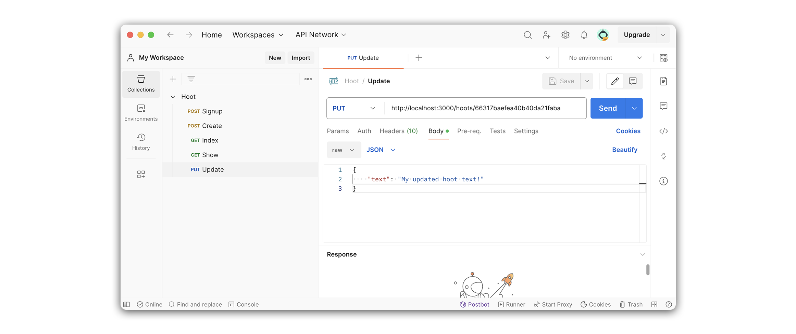
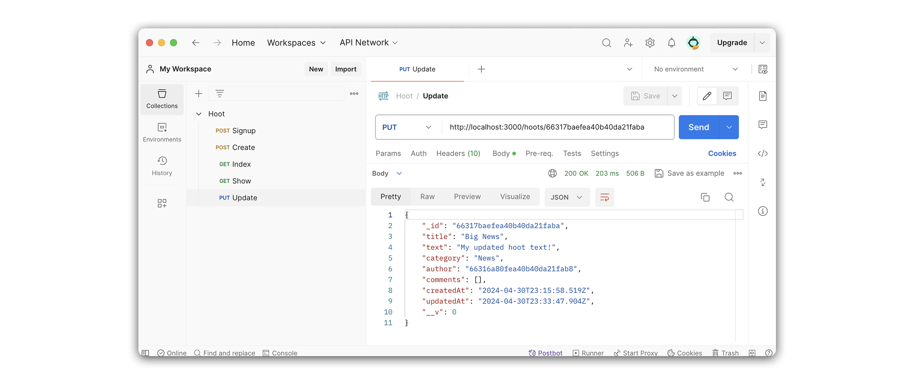

# 

**Learning objective:** By the end of this lesson, students will be able build a route that updates a single hoot in the database before issuing this updated object as a JSON response to the client.

## Overview

In this section, we will create an update route to find and update a single hoot. This route will be a `PUT` request on `/hoots/:hootId`, returning a JSON response with a single updated hoot from the database.

We will be following these specs when building the route:

- CRUD Action: UPDATE
- Method: `PUT`
- Path: `/hoots/:hootId`
- Response: JSON
- Success Status Code: `200` Ok
- Success Response Body: A JSON object with the updated hoot.
- Error Status Code: `500` Internal Server Error
- Error Response Body: A JSON object with an error key and a message describing the error.

## Define the route

Our route will listen for `PUT` requests on `'/hoots/:hootId'`:

```
PUT /hoots/:hootId
```

Add the following to `controllers/hoots.js`:

```js
// controllers/hoots.js
router.put('/:hootId', async (req, res) => { });
```

> 🚨 A user needs to be logged in to update a hoot, so we should define our new route inside the **Protected Routes** section of `controllers/hoots.js`.

> 💡 Remember, in `server.js`, we defined a base path of `/hoots` for our `hootsRouter`. Therefore, we will provide the `router` above with a path of `'/:hootId'`, as this will be appended to the end of what is defined in `server.js`.

## Code the controller function

Let's breakdown what we'll accomplish inside our controller function.

First, we'll retrieve the `hoot` we want to update from the database. We'll do this using our `Hoot` model's `findById()` method.

With our retrieved `hoot`, we need check that this `user` has permission to update the resource. We accomplish this using an `if` condition, comparing the `hoot.author` to `_id` of the user issuing the request (`req.user._id`). Remember, `hoot.author` contains the ObjectId of the `user` who created the `hoot`. If these values do not match, we respond with a `403` status.

If the `user` has permission to update the resource, we call upon our `Hoot` model's `findByIdAndUpdate()` method. 

When calling upon `findByIdAndUpdate()`, we pass in three arguments:

- The first is the ObjectId (`req.params.hootId`) by which we will locate the `hoot`. 

- The second is the form data (`req.body`) that will be used to update the `hoot` document.

- The third argument (`{ new: true }`) specifies that we want this method to **return the updated document**.

Finally, we issue a JSON response with the `updatedHoot` object.

Add the following to `controllers/hoots.js`:

```js
// controllers/hoots.js
router.put('/:hootId', async (req, res) => {
  try {
    const hoot = await Hoot.findById(req.params.hootId)

    if (!hoot.author.equals(req.user._id)) {
      return res.status(403).send("You're not allowed to do that!");
    }

    const updatedHoot = await Hoot.findByIdAndUpdate(
      req.params.hootId,
      req.body,
      { new: true }
    )

    res.status(200).json(updatedHoot);
  } catch (error) {
    res.status(500).json(error);
  }
});
```

> 🤯 As an extra layer of protection, we’ll use conditional rendering in our React app to limit access to this functionality so that only the author of a hoot can view the UI element for editing.

## Test the route in Postman

Now that we have finished the route let's test it with Postman. We'll do this by sending a `PUT` request to `http://localhost:3000/hoots/:hootId`. 

Create a new request in Postman. We will name this request **Update** and set its request type to `PUT`. To test it out, we'll need to grab a hoot `_id` again. Feel free to use the same Postman URL we used for **Show**.

```plaintext
http://localhost:3000/hoots/65f88f758b9a40bd02dacdbc
```

Add the following to the body section in **Postman**.

```json
{
    "text": "My updated hoot text!"
}
```

Your request should look something like this:



After sending the request, you should see the updated `hoot` object issued in the response:


